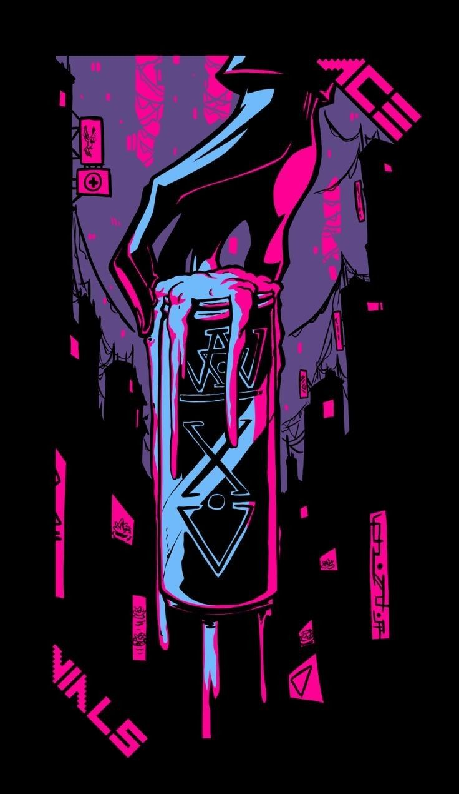
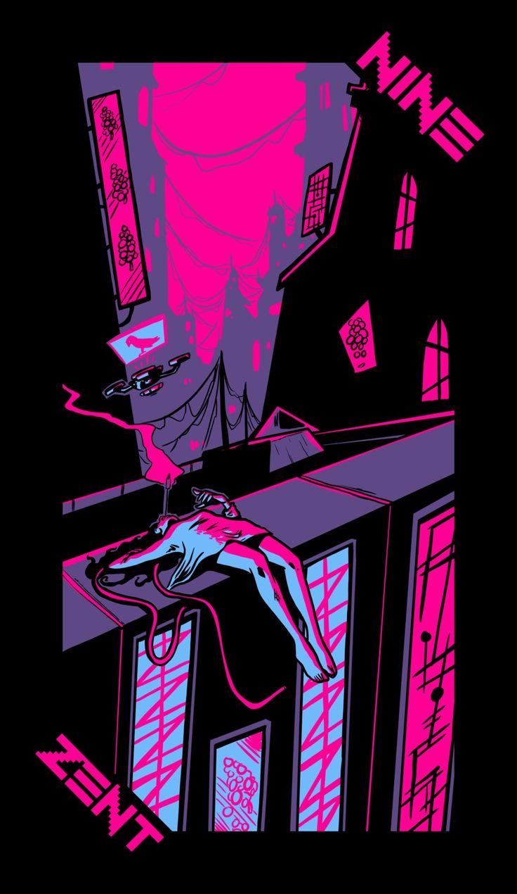

◾️◾️◾️◾️◾️◾️◾️◾️◾️◾️◾️◾️◾️◾️◾️◾️◾️◾️◾️◾️◾️◾️◾️◾️◾️◾️◾️◾️◾️◾️◾️◾️◾️◾️◾️◾️◾️◾️◾️◾️◾️◾️◾️◾️◾️◾️◾️◾️◾️◾️◾️◾️◾️◾️◾️◾️◾️◾️◾️◾️◾️◾️◾️◾️◾️◾️◾️◾️◾️◾️◾️◾️◾️◾️◾️◾️◾️◾️◾️◾️◾️◾️◾️◾️◾️◾️◾️◾️

🟣 - Glad to see you!

> Hello, my name is Jozé Hernández. I'm a fan of programming and full cybersecurity, I started 5 years ago in this world making mods and bots. Currently, I'm focused on finishing my degree in Systems Engineering and several personal projects in the world of c#. Greetings!!!

◾️◾️◾️◾️◾️◾️◾️◾️◾️◾️◾️◾️◾️◾️◾️◾️◾️◾️◾️◾️◾️◾️◾️◾️◾️◾️◾️◾️◾️◾️◾️◾️◾️◾️◾️◾️◾️◾️◾️◾️◾️◾️◾️◾️◾️◾️◾️◾️◾️◾️◾️◾️◾️◾️◾️◾️◾️◾️◾️◾️◾️◾️◾️◾️◾️◾️◾️◾️◾️◾️◾️◾️◾️◾️◾️◾️◾️◾️◾️◾️◾️◾️◾️◾️◾️◾️◾️◾️<pre>
⚫️ Systems Engineering student at the University of Margarita [UNIMAR](https://portalunimar.unimar.edu.ve/).
⚫️ Passionate about C# and its ecosystem, exploring new ways to optimize and create robust applications.
⚫️ Currently working on several personal projects under the name Misterio.
⚫️ Getting into the fascinating world of cybersecurity and hacking, thanks to the S4vitar initiative .
⚫️ Main languages: JavaScript, Python, C# and PHP.
⚫️ Interested in developing applications with Python, looking to create effective and easy to use solutions.
</pre>

◾️◾️◾️◾️◾️◾️◾️◾️◾️◾️◾️◾️◾️◾️◾️◾️◾️◾️◾️◾️◾️◾️◾️◾️◾️◾️◾️◾️◾️◾️◾️◾️◾️◾️◾️◾️◾️◾️◾️◾️◾️◾️◾️◾️◾️◾️◾️◾️◾️◾️◾️◾️◾️◾️◾️◾️◾️◾️◾️◾️◾️◾️◾️◾️◾️◾️◾️◾️◾️◾️◾️◾️◾️◾️◾️◾️◾️◾️◾️◾️◾️◾️◾️◾️◾️◾️◾️◾️

  
  
  

---

  <picture>
    <source media="(prefers-color-scheme: dark)" srcset="https://raw.githubusercontent.com/huiishan99/huiishan99/output/github-contribution-grid-snake-dark.svg">
    <source media="(prefers-color-scheme: light)" srcset="https://raw.githubusercontent.com/huiishan99/huiishan99/output/github-contribution-grid-snake.svg">
    
  </picture>  

---
